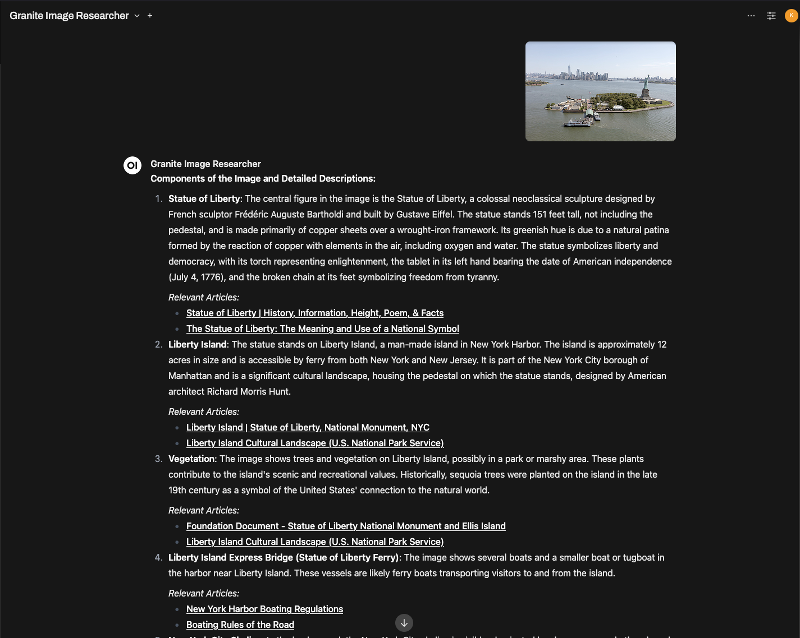
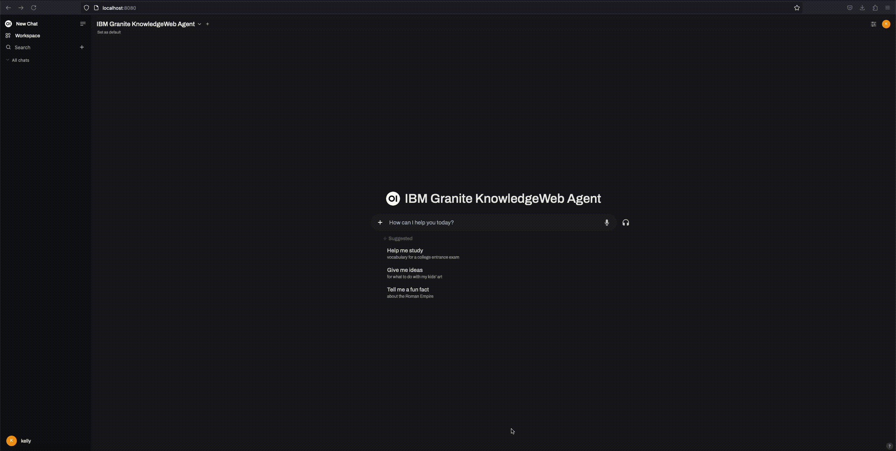
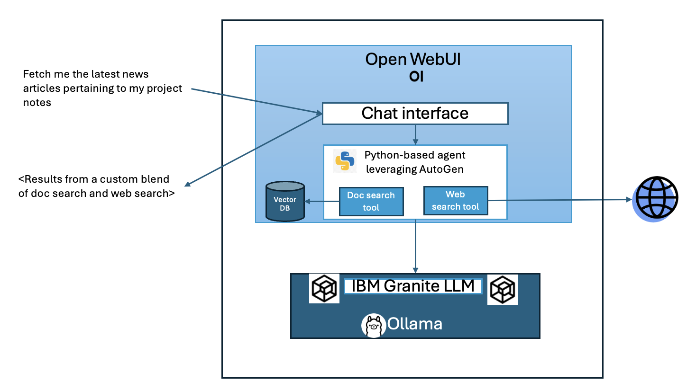
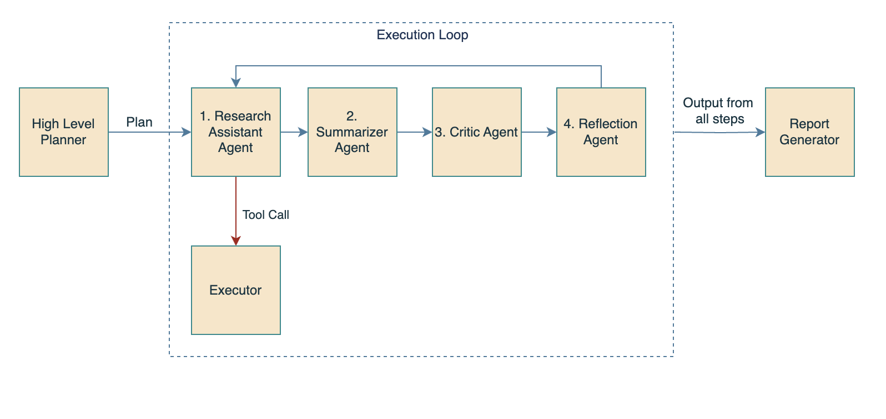

# Granite Retrieval and Image Research Agents

## 🚀 New Feature as of 2/26/25
We’ve added a new example alongside the Granite Retrieval Agent: an **Image Research Agent**. This agent uses the **Granite 3.2 language model** and **Granite 3.2 vision** to analyze images. It breaks down an image into components and dispatches parallel, asynchronous agents for detailed research. This implementation uses the **CrewAI framework** to demonstrate a different approach to agentic workflows.

---

## 📚 Table of Contents
Here's the corrected table syntax:

| Feature                | Description                                           | Models Used                            | Code Link                                                                            | Tutorial Link                                                                                   |
|------------------------|-------------------------------------------------------|----------------------------------------|---------------------------------------------------------------------------------------|---------------------------------------------------------------------------------------------------|
| Granite Retrieval Agent| General Agentic RAG for document and web retrieval using Autogen/AG2 | Granite 3.2 Language, Granite 3.2 Vision | [granite_autogen_rag.py](./granite_autogen_rag.py)                                     | [Build a multi-agent RAG system with Granite locally](https://developer.ibm.com/tutorials/awb-build-agentic-rag-system-granite/)        |
| Image Research Agent   | Image-based multi-agent research using CrewAI with Granite 3.2 Vision | Granite 3.2 Language, Granite 3.2 Vision | [image_researcher_granite_crewai.py](./image_researcher_granite_crewai.py)             | [Build an AI research agent for image analysis with Granite 3.2 Reasoning and Vision models](https://developer.ibm.com


---

## 🔑 Key Highlights
1. **Installation Instructions:** The setup process for Ollama and Open WebUI remains the same. Once configured, you can run either or both agents by copying the relevant Python file into Open WebUI.
2. **Optional SearXNG Usage:** Instead of requiring SearXNG directly, the agents now use the Open WebUI search API, which can integrate with SearXNG or other search engines. Configuration instructions are available [here](https://docs.openwebui.com/category/-web-search).

---

# Granite Retrieval Agent

The Granite Retrieval Agent repo is a collection of agents that implement Agentic RAG (Retrieval Augmented Generation) that answers queries using both local document and web retrieval. It demonstrates multi-agent task planning, adaptive execution, and tool calling with an open-source LLM such as Granite 3.2.

**Designed for local execution**, it runs efficiently on a powerful laptop or any compatible environment. (Initial tests were done using a MacBook Pro with an M3 Max Chip and 64GB of RAM.)

The core agent code integrates with [Open WebUI Functions](https://docs.openwebui.com/features/plugin/functions/) for easy interaction via a chat UI.

### Image Researcher


### Retrieval Agent


## Components
1. **Open WebUI** (Version 0.5 and up only supported)
2. **Ollama** for LLM inference
3. **Optional:** SearXNG or other search engines via Open WebUI search API
4. **Python script** implementing an Agentic Workflow, wrapped into Open WebUI Function


---

## High-Level Architecture


## Image Researcher Agent Architecture


## AG2 Retrival Agent Architecture


---

# Getting Started

## 1. Install Ollama
See [Ollama's README](https://github.com/ollama/ollama) for full installation instructions.

On macOS:
```bash
brew install ollama
```

On Linux:
```bash
curl -fsSL https://ollama.com/install.sh | sh
```

To run Ollama and download the model:
```bash
ollama serve
ollama pull granite3.2-dense:8b
```

## 2. Install Open WebUI
```bash
pip install open-webui
open-webui serve
```

## 3. Optional: SearXNG for Web Search
SearXNG is now optional! The agents use the Open WebUI search API, compatible with any search engine backend, including SearXNG.

We use SearXNG becuase it requires no API keys, with the caveat that you must run the SearXNG container locally.

Other alternatives are on the [Open WebUI documentation](https://docs.openwebui.com/category/-web-search).

To set up SearXNG (if desired):
```bash
docker run -d --name searxng -p 8888:8080 -v ./searxng:/etc/searxng --restart always searxng/searxng:latest
```
For configuring Open WebUI search API with SearXNG or other engines, follow [this guide](https://docs.openwebui.com/category/-web-search).

## 4. Import the Agent Python Script into Open WebUI
1. Go to `http://localhost:8080/` and log into Open WebUI.
2. Open the `Admin panel` from the lower-left menu.
3. In the `Functions` tab, click the `+` to add a new function.
4. Name it (e.g., "Granite RAG Agent" or "Image Research Agent").
5. Paste the relevant Python file (`granite_autogen_rag.py` or `image_research_agent.py`).
6. Save and toggle the agent to "Enabled."
7. Customize settings (inference endpoint, search API endpoint, model ID) via the gear icon.


## 5. Load Your Documents into Open WebUI
1. In Open WebUI, go to `Workspace` > `Knowledge`.
2. Click the `+` to add a new collection.
3. Upload documents for the Retrieval Agent to query.

## 6. Configure Web Search in Open WebUI

See the [Open WebUI documentation](https://docs.openwebui.com/category/-web-search) for detailed instructions for whichever search provider you choose.

If you have already setup SearXNG, then simpy go to the Open WebUI GUI to configure SearXNG connectivity: https://docs.openwebui.com/tutorials/web-search/searxng#4-gui-configuration

---

# Usage

## Image Explainer
You can simply upload any image, and it will begin its research. You may prompt it with specific details that you would like it to focus on. 


## AG2-based Retrieval Agent

Example queries for the **Granite Retrieval Agent**:
```text
What companies are prominent adopters of the open-source technologies my team is working on?
```

```text
Study my meeting notes to figure out the capabilities of the projects I’m involved in. Then, find me other open-source projects with similar features.
```

Example queries for the **Image Research Agent**:
```text
Analyze this image and find related research articles about the devices shown.
```

```text
Break down the image into components and provide a historical background for each object.
```

---

# ⚠️ Important Note
As of **12/25/24**, Open WebUI 0.5 introduced significant performance improvements. However, some users have reported occasional issues where chat results don't appear until refreshing the browser window.

---

With the addition of the Image Research Agent and the new flexible search API integration, the Granite Agent suite now supports both text and image-based research workflows. You can run one or both agents depending on your needs.
